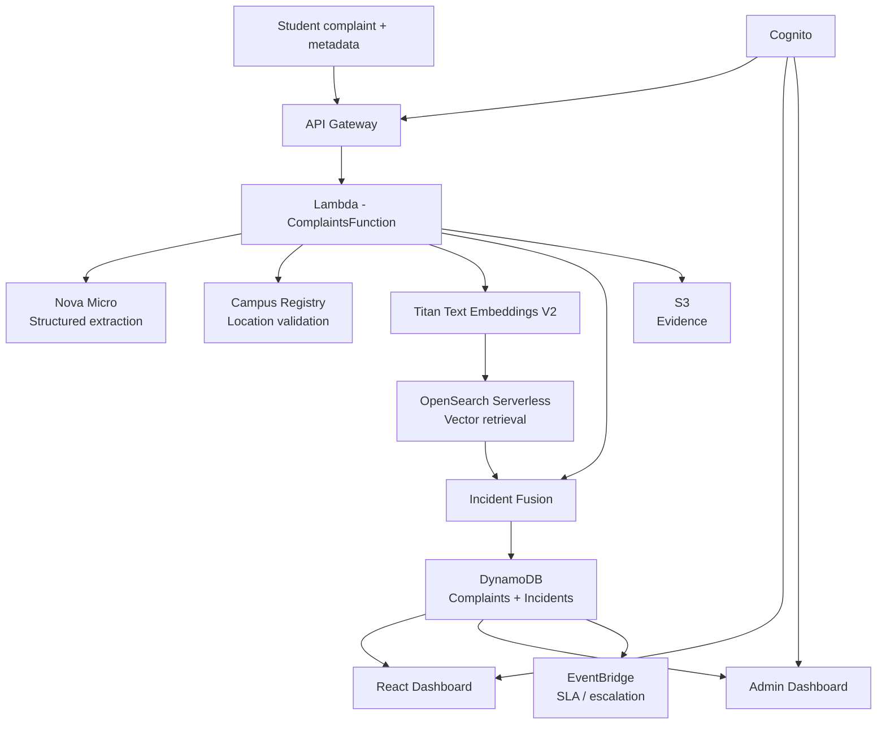

## Demo Video

[Watch the FixFlow Demo on YouTube](https://youtu.be/PAEE_yZ_JRs)

# FixFlow

> **FixFlow turns many messy campus complaints into a smaller number of actionable, explainable real-world incidents.**

FixFlow is an AI-powered campus complaint management system built for the **Bharat Builds Tour 2026 — First Commit** hackathon.

Instead of treating every complaint as an isolated ticket, FixFlow uses AI, embeddings, vector retrieval, and contextual rules to determine whether multiple reports describe the **same underlying incident**.

## Live Demo

**Student dashboard:** https://production.d1fgofpjkpwn4x.amplifyapp.com/

**Admin dashboard:** https://production.d1fgofpjkpwn4x.amplifyapp.com/admin

**GitHub:** https://github.com/pvachintya-tech/fixflow

## Demo Login Credentials

### Student
- Username: `demo-student`
- Password: `FixflowDemo10`

### Admin
- Username: `demo-admin`
- Password: `DemoAdmin10`

## The Problem

Campus complaint systems often produce a large number of repetitive reports:

- "No water in the library."
- "Library drinking water is not working."
- "The library water facility is unusable."

A basic ticketing system may create three separate complaints even though there is only one real-world problem.

This increases noise, makes prioritization harder, and can hide the true scale of an incident.

## Our Solution

FixFlow separates **complaints** from **incidents**.

A complaint is an individual report from a person.

An incident is the real-world problem that one or more complaints refer to.

When a new complaint arrives, FixFlow:

1. Extracts structured meaning from the complaint.
2. Validates important location information against the campus registry.
3. Creates a semantic embedding.
4. Retrieves similar historical complaints.
5. Runs **Incident Fusion** using multiple contextual signals.
6. Reuses an existing incident when the evidence supports a match, otherwise creates a new incident.
7. Tracks severity, impact, confidence, report count, and lifecycle status.

## ⭐ Incident Fusion

The core differentiator of FixFlow is that **semantic similarity alone does not decide whether complaints are merged**.

Incident Fusion evaluates:

- **Semantic similarity** — do the complaints describe a similar problem?
- **Location** — are they referring to the same place?
- **Category** — are they about the same type of issue?
- **Time** — are they close enough in time to plausibly represent the same incident?
- **Impact** — does the combined evidence indicate a broader problem?
- **Evidence / report context** — are there independent reports or conflicting information?

Conceptually:

```text
                  New Complaint
                       |
                       v
              Nova Micro extraction
                       |
                       v
             Campus Registry check
                       |
                       v
              Titan Embeddings V2
                       |
                       v
             OpenSearch retrieval
                       |
                       v
                Incident Fusion
       ┌───────────────┼────────────────┐
       v               v                v
 Same incident     New incident    Clarification
       |
       v
  DynamoDB state
       |
       +----------> Dashboard
       |
       +----------> SLA / escalation
       |
       +----------> Evidence in S3
```

This lets FixFlow avoid obvious false merges such as:

- same problem, different buildings
- same building, different issue categories
- similar wording referring to unrelated events

## Architecture



## AWS Services Used

| AWS Service | Role in FixFlow |
|---|---|
| **Amazon Bedrock – Nova Micro** | Extracts structured information and meaning from complaint text |
| **Amazon Bedrock – Titan Text Embeddings V2** | Converts complaint meaning into semantic vectors |
| **Amazon OpenSearch Serverless** | Retrieves semantically similar complaints using vector search |
| **Amazon DynamoDB** | Source of truth for complaints and incident state |
| **Amazon API Gateway** | Public API entry point |
| **AWS Lambda** | Complaint processing, fusion, lifecycle and API logic |
| **Amazon Cognito** | Student/admin authentication |
| **Amazon S3** | Evidence/attachment storage |
| **Amazon EventBridge** | SLA and escalation scheduling |
| **AWS SAM / CloudFormation** | Infrastructure as code and deployment |
| **AWS Amplify** | Hosting for the React frontend |

## AI + Data Flow

### 1. Structured understanding

Nova Micro converts free-form text into structured fields such as category, urgency/impact signals, and location information.

### 2. Semantic representation

Titan Text Embeddings V2 generates a vector representation of the complaint's meaning.

### 3. Retrieval

OpenSearch Serverless finds previously submitted complaints with similar semantic meaning.

### 4. Incident Fusion

Retrieved candidates are evaluated with contextual rules rather than merging on similarity alone.

### 5. Incident state

DynamoDB stores the authoritative complaint and incident records, including incident relationships, severity, impact and lifecycle status.

## Trust, Safety and Edge Cases

FixFlow treats AI output as **decision support**, not ground truth.

Examples:

- Invalid locations can be sent for clarification rather than silently accepted.
- Reports about theft or misconduct remain allegations/unverified rather than declaring guilt.
- Similar text from different locations is not automatically merged.
- Conflicting reports can be preserved and flagged.
- Reporter identity comes from authenticated Cognito identity rather than trusting a user-supplied identity field.
- Complaint text is treated as untrusted input and is processed through controlled structured-output paths.

## Incident Lifecycle

Incidents can move through:

```text
UNCONFIRMED → PROBABLE → CONFIRMED → RESOLVED
```

The admin dashboard provides incident management and status updates.

## Project Structure

```text
fixflow/
├── backend/
│   ├── src/
│   │   ├── handlers/
│   │   ├── services/
│   │   ├── repositories/
│   │   ├── models/
│   │   └── tests/
│   └── requirements.txt
├── infrastructure/
│   └── template.yaml
├── src/
│   ├── components/
│   ├── config/
│   ├── pages/
│   └── services/
├── public/
├── package.json
└── README.md
```

## Running the Frontend

```bash
npm install
npm run dev
```

Production build:

```bash
npm run build
```

## Deploying the Backend

The backend is deployed with AWS SAM.

```bash
sam build -t infrastructure/template.yaml
sam deploy
```

Infrastructure is defined in:

```text
infrastructure/template.yaml
```

## AI Coding Disclosure

AI coding assistants were used during development for code drafting, debugging, iteration, and implementation support. The team reviewed, tested, integrated, and validated the resulting code and AWS deployment.

## Hackathon

Built for:

**Bharat Builds Tour 2026 — Stop 1: First Commit**

The project uses AWS as a core part of the deployed application and demonstrates AI-powered complaint understanding, semantic retrieval, and incident fusion.
